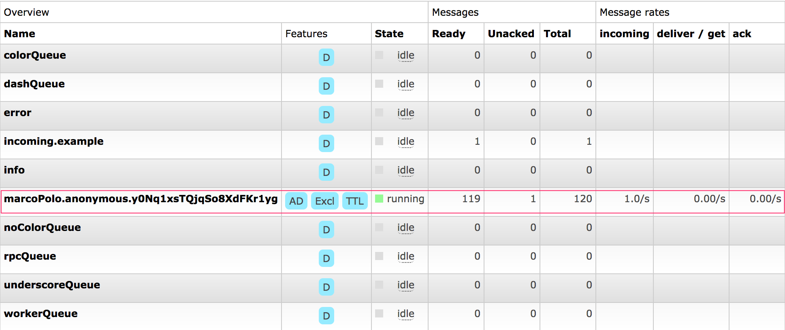
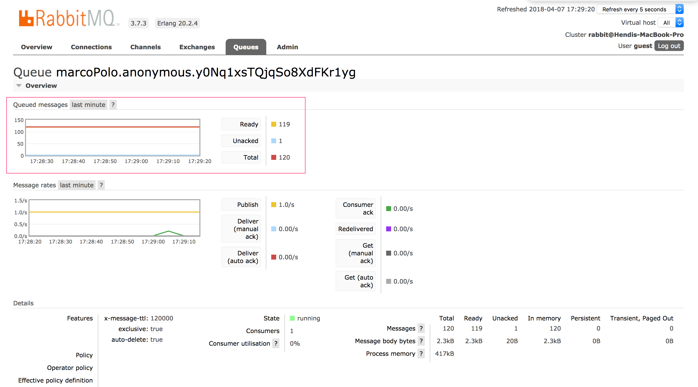

# Marco-Polo: A Spring Cloud Stream Demo

This repository contains two separate Spring Cloud Stream applications demonstrating reactive message streaming with
RabbitMQ:

* **Marco**: A message producer that publishes messages every second using Spring Cloud Stream functional programming
  model
* **Polo**: A message consumer that processes messages slowly (1 minute delay) to demonstrate queue backpressure and TTL

## Overview

Marco produces messages at a rate of 1 per second. Polo consumes messages but deliberately sleeps for 1 minute after
each message to simulate a slow consumer. This creates a backed-up queue scenario.

To prevent unbounded queue growth, Polo configures a message Time-To-Live (TTL) of 120 seconds (2 minutes). Messages
unconsumed after 2 minutes are automatically discarded by RabbitMQ.

## Technologies

- **Spring Boot**: 3.5.6
- **Spring Cloud Stream**: 4.3.0 (functional programming model)
- **Spring Cloud Function**: 4.3.0
- **RabbitMQ**: Latest (via Docker)
- **Java**: 21
- **Build Tool**: Maven 3.9.11+

## Prerequisites

- Java 21 or higher
- Maven 3.6.3 or higher
- Docker Desktop (running)

## Quick Start

### 1. Start RabbitMQ

First, ensure Docker Desktop is running, then start RabbitMQ using Docker Compose:

```bash
docker-compose up -d
```

This will start RabbitMQ with management console on:

- AMQP Port: `5672`
- Management Console: `http://localhost:15672` (username: `guest`, password: `guest`)

### 2. Build the Applications

Build both Marco and Polo applications:

```bash
# Build Marco
cd marco
mvn clean package

# Build Polo
cd ../polo
mvn clean package
```

### 3. Run the Applications

Open two terminal windows and run each application:

**Terminal 1 - Polo (Consumer):**

```bash
cd polo
mvn spring-boot:run
```

**Terminal 2 - Marco (Producer):**

```bash
cd marco
mvn spring-boot:run
```

It doesn't matter which application you start first. After both are running, you should see Polo logging messages from
Marco approximately once per minute.

### 4. Monitor the Applications

- **Polo** runs on: `http://localhost:8082`
- **Marco** runs on: `http://localhost:8081`
- **RabbitMQ Management Console**: `http://localhost:15672`

## Examining the Queue

While Marco and Polo are running, you can examine the queue by pointing a web browser to the RabbitMQ console
at http://localhost:15672 (username: `guest`, password: `guest`).

1. Click on the **"Queues"** tab at the top
2. Look for the "marcoPolo" queue (the full name will include `.anonymous.` followed by a random ID)



### Queue Features

Notice the items under the "Features" column which indicate important queue characteristics:

* **Excl** - This is an exclusive queue. Polo created the queue and is the only client that can consume messages from
  it. When Polo terminates, the queue will be automatically destroyed.

* **AD** - The queue is set to auto-delete. It will be deleted when the last subscriber unsubscribes. This feature works
  in conjunction with the Excl feature.

* **TTL** - This queue has a time-to-live set for its messages (2 minutes / 120 seconds).

### Queue Size

You'll notice that the total number of messages in the queue is capped at roughly **120 messages**. It might be slightly
higher or lower depending on timing, but it will never exceed this by much as long as:

- There is only one producer
- Messages are produced at a rate of one per second
- The TTL is set to 120 seconds

Click on the queue name to see more details, including a graph showing the number of messages over time:



### Understanding TTL

The queue size isn't capped by a specific message count, but rather by the TTL. Here's how it works:

- Each message has a maximum lifetime of 120 seconds
- Messages are either consumed by Polo or automatically removed after TTL expires
- If you have multiple producers or faster production rates, the queue size will increase proportionally
- However, no message will survive in the queue beyond its TTL period

## Architecture & Code Updates

This project has been updated to use **Spring Cloud Stream 4.x** functional programming model, which replaces the
deprecated annotation-based approach.

### Marco (Producer)

**Before (Deprecated):**

```java
@EnableBinding(Source.class)
@InboundChannelAdapter(value = Source.OUTPUT, poller = @Poller(...))
```

**After (Functional):**

```java

@Bean
public Supplier<Flux<String>> marcoSupplier() {
    return () -> Flux.interval(Duration.ofSeconds(1))
            .map(tick -> "MARCO: " + System.currentTimeMillis());
}
```

Configuration (`marco/src/main/resources/application.yml`):

```yaml
spring:
  cloud:
    stream:
      function:
        definition: marcoSupplier
      bindings:
        marcoSupplier-out-0:
          destination: marcoPolo
```

### Polo (Consumer)

**Before (Deprecated):**

```java

@EnableBinding(Sink.class)
@ServiceActivator(inputChannel = Sink.INPUT)
public void loggerSink(Object payload) { ...}
```

**After (Functional):**

```java

@Bean
public Consumer<String> poloConsumer() {
    return payload -> {
        logger.info("POLO: " + payload);
        Thread.sleep(60000);
    };
}
```

Configuration (`polo/src/main/resources/application.yml`):

```yaml
spring:
  cloud:
    stream:
      function:
        definition: poloConsumer
      bindings:
        poloConsumer-in-0:
          destination: marcoPolo
      rabbit:
        bindings:
          poloConsumer-in-0:
            consumer:
              ttl: 120000
```

## Troubleshooting

### Docker not running

If you see "Connection refused" errors, ensure Docker Desktop is running:

```bash
docker ps
```

### Port already in use

If ports 8081 or 8082 are already in use:

```bash
# Find and kill the process
lsof -ti:8081 | xargs kill -9
lsof -ti:8082 | xargs kill -9
```

### Maven version issues

Ensure you're using Maven 3.6.3 or higher:

```bash
mvn -version
```

## Project Structure

```
SpringCloudStreamDemo/
├── docker-compose.yml          # RabbitMQ configuration
├── README.md
├── marco/                      # Producer application
│   ├── pom.xml
│   └── src/
│       ├── main/
│       │   ├── java/com/hendisantika/marco/
│       │   │   └── MarcoApplication.java
│       │   └── resources/
│       │       └── application.yml
│       └── test/
└── polo/                       # Consumer application
    ├── pom.xml
    └── src/
        ├── main/
        │   ├── java/com/hendisantika/polo/
        │   │   └── PoloApplication.java
        │   └── resources/
        │       └── application.yml
        └── test/
```

## License

This is a demonstration project for learning Spring Cloud Stream.


